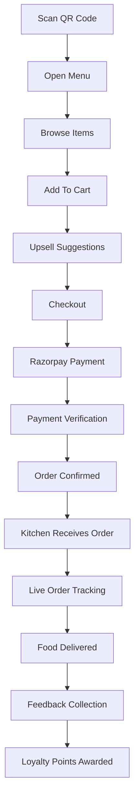

# RestaurantOS

### Smart QR Ordering & Restaurant Management Platform

---

# Overview

RestaurantOS is a modern QR-powered restaurant ordering and operations platform designed to replace traditional menus, reduce staff workload, increase revenue, and improve customer experience.

Customers can scan a QR code, browse the menu, place orders, pay online, track order status, and request assistance without creating an account.

The platform combines ordering, payments, kitchen management, loyalty, promotions, analytics, and inventory intelligence into a single system.

---

# Core Objectives

## Customer Objectives

* Fast ordering
* No app installation
* No account creation
* Fast checkout
* Live order tracking
* Easy payment experience

## Restaurant Objectives

* Increase revenue
* Increase average order value
* Reduce waiter workload
* Reduce ordering mistakes
* Improve customer retention
* Improve kitchen efficiency
* Gain business insights

---

# User Roles

## Customer

Can:

* Browse menu
* Add items to cart
* Pay online
* Track orders
* Call waiter
* Leave feedback
* Earn loyalty rewards

---

## Restaurant Owner

Can:

* Manage menu
* Manage inventory
* View analytics
* Manage promotions
* View customer feedback
* Manage staff

---

## Staff / Waiter

Can:

* Receive assistance requests
* View orders
* Update order status

---

## Kitchen Staff

Can:

* View incoming orders
* Update preparation status
* Manage item availability

---

# Customer Journey



---

# QR Ordering System

## Features

### QR Table Identification

Each table receives a unique QR.

Example:

| Table | QR    |
| ----- | ----- |
| 1     | QR001 |
| 2     | QR002 |
| 3     | QR003 |

---

### Secure Session

No login required.

Each scan creates:

* Temporary session
* Table assignment
* Expiring token

---

### Benefits

* No registration friction
* Faster ordering
* Reduced abandonment

---

# Menu Experience

## Menu Categories

* Starters
* Main Course
* Pizza
* Burgers
* Beverages
* Desserts

---

## Search

Customers can search:

* Dish names
* Ingredients
* Categories

---

## Filters

* Vegetarian
* Non-Vegetarian
* Vegan
* Spicy
* Popular
* Recommended

---

## Menu Item Structure

### Example

Butter Chicken

* ₹320
* 25 min preparation
* Bestseller
* High Rating
* Item Image

---

# Smart Availability

## Status Types

### Available

Item can be ordered.

### Limited Quantity

Low stock warning.

### Out of Stock

Ordering disabled.

---

## Automatic Inventory Integration

Example:

Chicken Stock = 0

Automatically:

* Chicken Biryani Disabled
* Butter Chicken Disabled
* Chicken Tikka Disabled

---

# Recommendation Engine

## AI Recommendations

Based on:

* Cart contents
* Popular dishes
* Time of day
* Historical sales

---

## Example

Customer adds:

* Burger

Recommend:

* Fries
* Coke
* Brownie

---

# Upselling System

## Goal

Increase Average Order Value

---

## Example

Current Cart:

* Pizza

Suggested:

* Garlic Bread
* Soft Drink

One-click add to cart.

---

# Cross-Sell Engine

## Checkout Recommendations

Example:

Customers who bought:

* Biryani

Also bought:

* Raita
* Gulab Jamun

---

# Sponsored Item System

## Restaurant Promotions

Examples:

### Chef Recommendation

Butter Chicken

---

### Most Ordered

Paneer Tikka

---

### Weekend Special

Family Combo

---

# Advertisement System

## Home Banner

Examples:

* Buy 2 Pizza Get 1 Coke Free
* Summer Drink Festival
* Weekend Family Combo

---

## Category Banner

Example:

Desserts Category

"20% Off All Brownies Today"

---

## Event Campaigns

Examples:

* IPL Special Menu
* Valentine's Dinner
* Christmas Combo

---

# Payment System

## Payment Gateway

Razorpay

Supported Methods:

* UPI
* Credit Card
* Debit Card
* Wallets
* Net Banking

---

## Payment Flow

```text
Create Order
↓
Open Razorpay
↓
Customer Pays
↓
Verify Signature
↓
Confirm Order
↓
Send To Kitchen
```

---

## Security

* HTTPS
* Signed Table Tokens
* Server-side Verification
* Anti-Duplicate Payments

---

# Order Tracking

## Live Status

### Order Received

Order created.

### Accepted

Restaurant accepted.

### Preparing

Kitchen working.

### Ready

Ready for pickup/delivery.

### Served

Order completed.

---

## Estimated Time

Example:

18 Minutes Remaining

Based on:

* Kitchen load
* Item complexity
* Active orders

---

# Waiter Assistance System

## Call Waiter Button

Customer can request:

* Water
* Cutlery
* Bill
* Cleaning
* Manager

---

## Staff Notification

Example:

Table 12 requires assistance.

---

# Loyalty Program

## No Login Required

Optional phone number collection.

---

## Rewards

Example:

100 Points = Free Dessert

500 Points = ₹250 Discount

---

## Visit Rewards

Examples:

* 5 Visits = Free Drink
* 10 Visits = Free Meal

---

# Post-Payment Engagement

## Review Collection

Prompt customer to rate:

* Food
* Service
* Ambience
* Speed

---

## Promotional Banner

Examples:

* Follow us on Instagram
* Get 10% off next visit
* Refer a friend

---

# Kitchen Display System (KDS)

## Incoming Order

Order #1245

Table 7

* 2 Burger
* 1 Fries
* 1 Coke

Paid

---

## Status Controls

* Accepted
* Preparing
* Ready
* Served

---

## Priority Levels

* VIP
* Urgent
* Normal

---

# Inventory Management

## Ingredient Tracking

Examples:

* Chicken
* Paneer
* Cheese
* Coke

---

## Alerts

Low stock notifications.

---

## Auto Availability Updates

Inventory changes automatically update menu availability.

---

# Analytics Dashboard

## Revenue Metrics

* Daily Revenue
* Weekly Revenue
* Monthly Revenue

---

## Order Metrics

* Total Orders
* Average Order Value
* Repeat Customers

---

## Customer Metrics

* New Customers
* Returning Customers
* Loyalty Usage

---

## Sales Insights

### Best Sellers

Top-performing dishes.

### Low Performers

Items with low sales.

### Peak Hours

Traffic by time.

---

# Customer Feedback Analytics

## Ratings Dashboard

Track:

* Food Quality
* Service Quality
* Delivery Speed

---

## AI Summary

Example:

Most Mentioned Positive Topics

* Taste
* Portion Size

Most Mentioned Negative Topics

* Wait Time
* Seating

---

# Staff Management

## Permissions

### Owner

Full Access

### Manager

Operations Access

### Staff

Limited Access

### Kitchen

Kitchen Access Only

---

# Multi-Language Support

Supported Languages

* English
* Hindi
* Punjabi

Future:

* Arabic
* French
* Spanish

---

# Mobile Responsive Design

## Customer Interface

Mobile First

Optimized for:

* Android
* iPhone
* Tablets

---

# Future Features

## AI Wait Time Prediction

Predict actual preparation time.

---

## Dynamic Pricing

Time-based promotions.

---

## Smart Combo Generator

Automatically create profitable combos.

---

## Voice Ordering

Order using voice commands.

---

## WhatsApp Receipts

Send receipts directly to WhatsApp.

---

## AI Restaurant Assistant

Restaurant chatbot capable of:

* Menu questions
* Recommendations
* Order assistance
* Complaint handling

---

# Success Metrics

## Business Metrics

* Average Order Value
* Revenue Growth
* Repeat Customer Rate
* Promotion Conversion Rate

---

## Operational Metrics

* Order Processing Time
* Kitchen Efficiency
* Inventory Accuracy
* Staff Response Time

---

## Customer Metrics

* Customer Satisfaction Score
* Order Completion Rate
* Loyalty Participation
* Average Session Duration

---

# Tagline

**Scan. Order. Pay. Track. Enjoy.**
