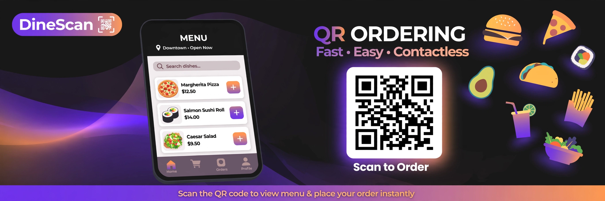

# RestaurantOS — Instagram-themed QR Ordering Platform

> ## Status: 🟡 In Progress
>
> <progress value="75" max="100"></progress>
>
> **Progress: 75%** — Core platform works (verified running). Payment is simulated, file uploads and production DB still to do.

<p align="center">
  
</p>


## What it is

RestaurantOS is a connected, multi-tenant restaurant ordering platform built from [PRD.md](PRD.md). One backend serves three roles: an **admin panel** (create restaurant-owner accounts), an **owner panel** (manage menu, tables, categories, promos), and an **Instagram-style customer site** where diners scan a QR code at their table and order from their phone. All data lives in a JSON file — one `npm install`, no external database.

## What works (verified)

- ✅ **Server starts cleanly** — `node server.js` boots, seeds demo data, prints all logins (verified by running it)
- ✅ **Admin panel** — create owner accounts, returns email + password + customer URL (`/admin`)
- ✅ **Owner panel** — manage restaurant name, logo, bio, table count, categories, full menu with images/descriptions/prices/veg/spicy flags (`/owner`)
- ✅ **Customer site** — Instagram-style feed at `/r/:slug`, per-table QR sessions via `?t=<tableNumber>`
- ✅ **Auth** — scrypt-hashed passwords, httpOnly cookie sessions
- ✅ **Order flow** — cart, checkout, order tracking, call-waiter (per PRD)

## Tech stack

| Layer | Technology |
|-------|-----------|
| Backend | Node.js + Express 4 |
| Database | JSON file store (`data/db.json`) |
| Auth | scrypt hashing, cookie sessions |
| Frontend | Server-rendered HTML + vanilla JS |
| Payments | Razorpay (frontend simulation only) |

## How to run

```bash
npm install        # installs express (first time only)
npm start          # → http://localhost:4173
```

The first run seeds the database and prints all logins.

| Role | URL | Login |
|------|-----|-------|
| Landing | `http://localhost:4173/` | — |
| Admin | `http://localhost:4173/admin` | `admin@restaurantos.app` / `admin123` |
| Owner (demo) | `http://localhost:4173/owner` | `owner@tandoori.app` / `owner123` |
| Customer | `http://localhost:4173/r/tandoori-tales` | no login (QR session) |

A table's QR code points at `/r/<slug>?t=<tableNumber>`.

## What you can add more

- [ ] **Real Razorpay integration** — wire `processPayment()` to a real Razorpay order + server-side signature verification (currently simulated)
- [ ] **File uploads** — menu images are URLs today; add `multer` for direct uploads
- [ ] **Production database** — replace JSON file with PostgreSQL/MongoDB for concurrent writes
- [ ] **HTTPS + secure sessions** — required before any public deployment
- [ ] **Kitchen display system** — live order screen for kitchen staff
- [ ] **Analytics dashboard** — sales, popular items, peak hours for owners
- [ ] **Multi-language menu** — for diverse customer bases

## Project structure

```
QR-Menu-Order/
├── server.js         # Express app entry point
├── server/           # API routes (admin, owner, public)
├── admin/            # Admin panel frontend
├── owner/            # Owner panel frontend
├── assets/           # Static assets + banner
├── index.html        # Landing page
├── landing.html      # Marketing page
└── PRD.md            # Full product requirements
```

---
*README written after code audit on 2026-10-08. Server verified running.*
